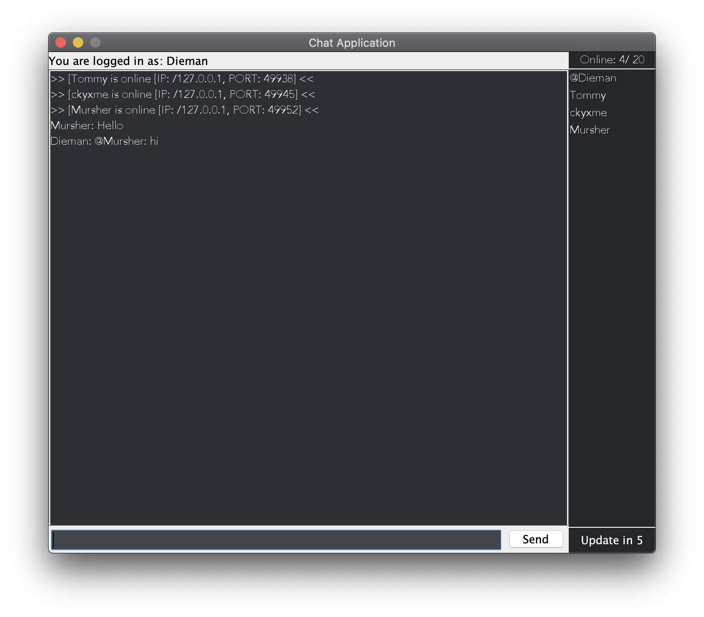
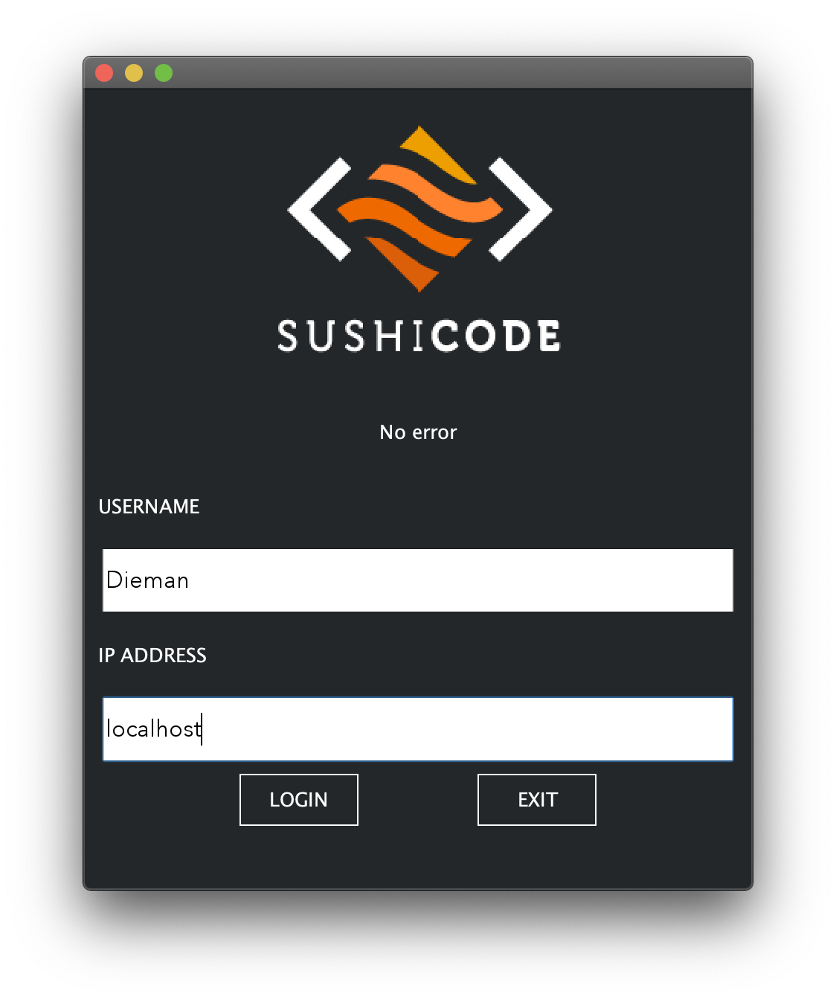
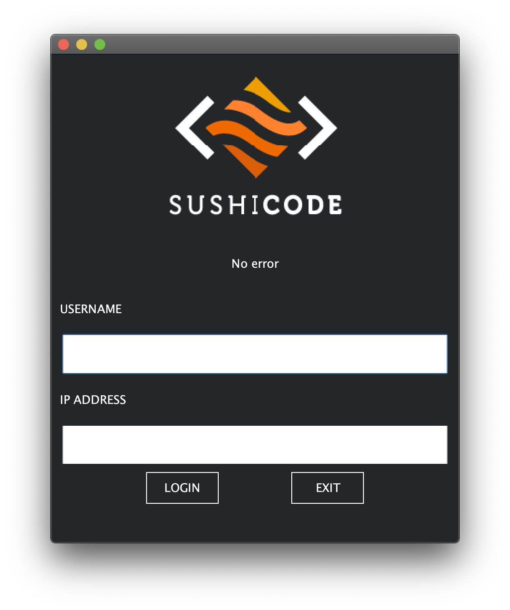

<!-- PROJECT SHIELDS -->
<!--
*** I'm using markdown "reference style" links for readability.
*** Reference links are enclosed in brackets [ ] instead of parentheses ( ).
*** See the bottom of this document for the declaration of the reference variables
*** for contributors-url, forks-url, etc. This is an optional, concise syntax you may use.
*** https://www.markdownguide.org/basic-syntax/#reference-style-links
-->
[![Contributors][contributors-shield]][contributors-url]
[![Forks][forks-shield]][forks-url]
[![Stargazers][stars-shield]][stars-url]
[![Issues][issues-shield]][issues-url]
[![MIT License][license-shield]][license-url]
[![LinkedIn][linkedin-shield]][linkedin-url]

<!-- PROJECT LOGO -->
 

  

  <h3 align="center">Chat Application</h3>

  

    An application realised for an university project.
     
    <a href="https://github.com/Dieman89/chatApp"><strong>Explore the docs »</strong></a>
     
     
    <a href="https://github.com/Dieman89/chatApp">View Demo</a>
    ·
    <a href="https://github.com/Dieman89/chatApp/issues">Report Bug</a>
    ·
    <a href="https://github.com/Dieman89/chatApp/issues">Request Feature</a>
  

<!-- ABOUT THE PROJECT -->
## About The Project

    
    
    

This application implements a networked distributed system for a group-based peer to peer communication, which conforms
with the following requirements

## Features and Logic

All members know of all other members.
When a new member joins (connects), he/she has to provide following parameters as an input:
1. A nickname (ensuring that each member has an unique nickname)
2. a port it will listen to, its IP number and
3. a port and IP number of one of the existing members

* If a member is the first one, the member has to be informed about it at start-up. Then this member will become
the administrator.
* The new member(s) will then contact the existing members and the existing members will tell the new member(s) everyone's
nickname, IP addresses and ports - including - the IP address, port and nickname of the current group admin.
* After this, the new member will contact everyone to let them know that they can add it to the set of members.
* In case some of the members do not respond, it will inform all the other members about this, and the other members can
update their list of existing members.
* If the admin does not respond, then a new member must be assigned as administrator.
* The administrator maintains state of group members by checking periodically how many of them are online and informs active members about it so 
that they can update their state of members.
* Any member can quit by a simple CTRL+C command.

## Programming Principles and Practices

This project demonstrate the following programming principles and practices:

* Group formation, connection and communication: A group is correctly formed connecting with all members where all members can communicate without any error.
* Group state maintenance: The state of the group is maintened correctly. This includes recording of the messages exchanged among members of the group with timestamps.
* Administrator selection: Automatically choose the administrator even when the existing one is disrupted/disconnected abnormally.
* Use of design patterns: Adequate use of various design patterns in the implementation of the project.
* Fault tolerance: Adequate strategy implementation for the fault tolerance. In particular, when a member or admin terminates abnormally.
* JUnit based testing of the application: testing for the implementation of all of the main requirements.
* Use of component-based development: Adequate design and development of components in the implementation.

### Built With

* [IntelliJ Idea](https://www.jetbrains.com/idea/)
* [Java](https://www.java.com/)
* [JUnit](https://junit.org/junit5/)

## License

Distributed under the MIT License. See `LICENSE` for more information.

## Contacts

Alessandro Buonerba [@Dieman_](https://twitter.com/Dieman_) - a.buonerba@hotmail.com

Tommaso Bruno [@Tommy__of](https://twitter.com/Tommy__of) - tommaso_bruno@icloud.com

Project Link: [https://github.com/Dieman89/chatApp](https://github.com/Dieman89/chatApp)

<!-- MARKDOWN LINKS & IMAGES -->
<!-- https://www.markdownguide.org/basic-syntax/#reference-style-links -->
[contributors-shield]: https://img.shields.io/github/contributors/Dieman89/chatApp.svg?style=flat-square
[contributors-url]: https://github.com/Dieman89/chatApp/graphs/contributors
[forks-shield]: https://img.shields.io/github/forks/Dieman89/chatApp.svg?style=flat-square
[forks-url]: https://github.com/Dieman89/chatApp/network/members
[stars-shield]: https://img.shields.io/github/stars/Dieman89/chatApp.svg?style=flat-square
[stars-url]: https://github.com/Dieman89/chatApp/stargazers
[issues-shield]: https://img.shields.io/github/issues/Dieman89/chatApp.svg?style=flat-square
[issues-url]: https://github.com/Dieman89/chatApp/issues
[license-shield]: https://img.shields.io/github/license/othneildrew/Best-README-Template.svg?style=flat-square
[license-url]: https://github.com/Dieman89/chatApp/blob/master/LICENSE
[linkedin-shield]: https://img.shields.io/badge/-LinkedIn-black.svg?style=flat-square&logo=linkedin&colorB=555
[linkedin-url]: https://linkedin.com/in/buonerba
[screenshot]: images/screenshot.png